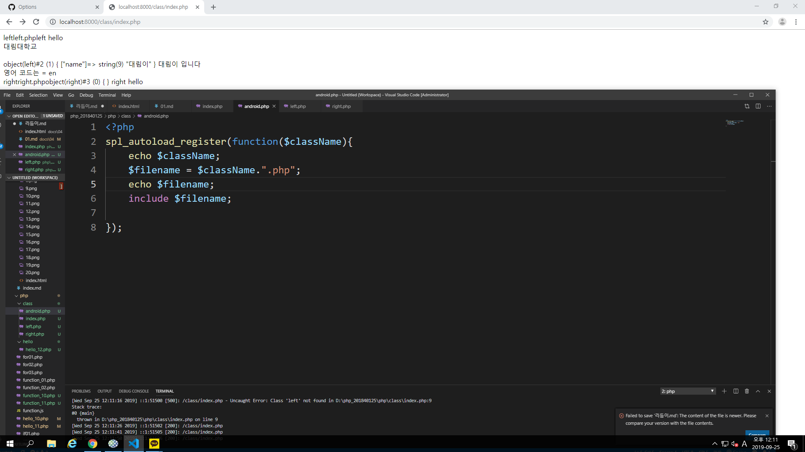

# 수업 2019.09.25
수업내용 정리

  
  
  
파일 안에 파일을 추가할 수 있다  
  
경고가 나와도 @를 넣으면 경고는 안나온다  
  
경고 뜬 것이 없어지고 정상적으로 작동한다  
require 은 해당 파일이 없으면 스스로 종료한다  
  
다른폴더 안에 있는 파일을 출력할때 경로를 체크해줘야한다  
기호없을때 : 같은폴더안에서 찾는다  
/ : root 폴더  
  
function 함수로 출력하기  
  
return 출력  
  
배열출력  
  
  
  
Class 는 함수보다 더 큰 함수  
  
  
메소드로 출력가능  
  
  
  
  
  
  
  
  
  
메소드를 이어주게 해준다  
메소드 체인  
  
  
  
  
$  php -S localhost:8000 -t ./php  
접속코드  
  

